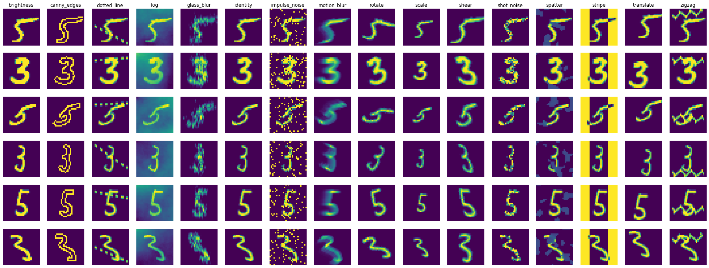

# Summary Prior
Incorporating summary prior information to Bayesian Deep Learning

## To start
```
git clone --recursive git@github.com:v-i-s-h/summary-prior.git
cd summary-prior
ln -s ./bayesian-torch-repo/bayesian_torch .
```

## Corrupted dataset

### Binary MNIST

