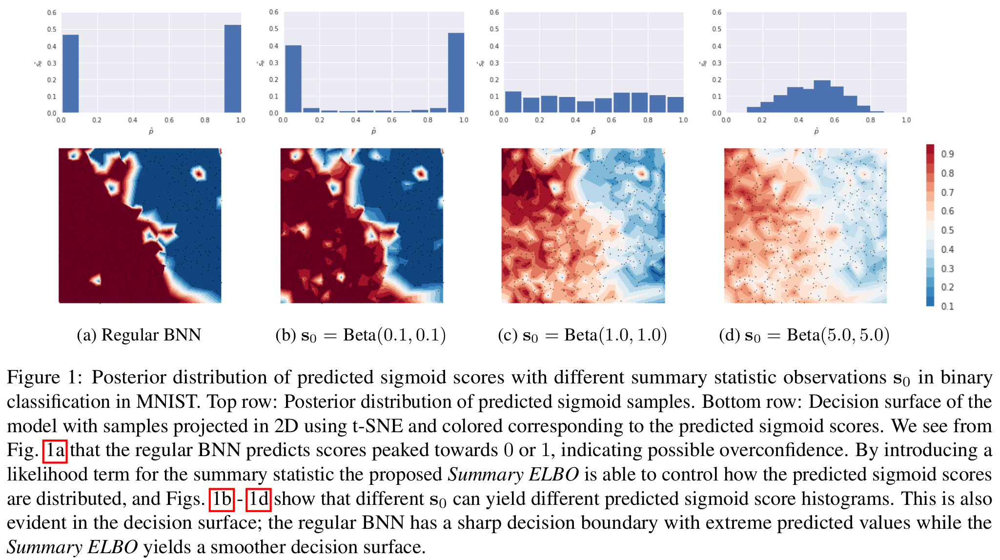

# Look beyond labels: Incorporating functional summary information in Bayesian neural networks
Incorporating summary prior information to Bayesian Deep Learning

## To start
```
git submodule update --init
ln -s ./bayesian-torch-repo/bayesian_torch .
```

## Incorporating summary information



## Algorithms
### 1. Mean Field Variational Inference
Example: See [slurm script](./slurm-scripts/submit_mnistc_mfvi.sh).

### 2. Summary Likelihood
Exmaple: See [slurm script](./slurm-scripts/submit_mnistc_sl.sh).

## Requirements
1. Pytorch
2. Pytorch Lightning
3. Tensorboard
4. Scipy
5. tbparse

